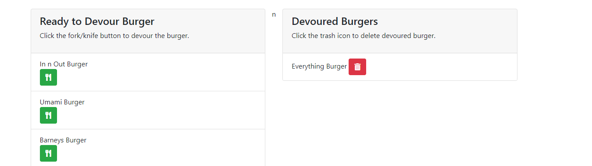

# Eat-Da-Burger
 A burger logger created with MySQL, Node, Express and Handlebars


by Pirooz Wallace
1/9/21


[](#license)

Deployed Heroku App: [App on Heroku](https://still-garden-09395.herokuapp.com/)

GitHub Repo: [Eat Da Burger Repo](https://github.com/attack-theoRy/eat-da-burger)


Portfolio: [Portfolio](https://attack-theory.github.io/Portfolio/)


## Table of Contents
* [API's + Tech](#tech)
* [Description](#description)
* [Installation](#installation)
* [License](#license)
* [Questions](#questions)

## Tech
* Node.js
* Express
* Express-Handlebars
* MySQL and MySQL (Workbench)
* Heroku and Jaws_db


## Description

This is a full-stack app that uses Node.js, MySQL, Express routes, express handlebars and heroku to add and then log burgers you have eaten from a database. You start by either adding your own burger to the list using the submit form or by devouring what's already there. 


You click on the utensil icon to devour the burger and put it in the devoured list




## Installation

The app can be found with no installation needed on heroku at :  https://still-garden-09395.herokuapp.com/
Or to use through terminal do the following:
To use properly you need to install Node.js and in the terminal you have to use the command 
``` npm init -y ```
and then also install the following dependencies 
``` npm install express ```  to install express
``` npm install express-handlebars  ``` to install handlebars
``` npm install mysql ``` to install mysql

The databases were seeded separately using MySQL Workbench with the 'seeds' file.


And then finally to start the application you type ``` node server.js ``` in the terminal.

## License

MIT License

Copyright (c) [2020] [Pirooz Wallace]

Permission is hereby granted, free of charge, to any person obtaining a copy
of this software and associated documentation files (the "Software"), to deal
in the Software without restriction, including without limitation the rights
to use, copy, modify, merge, publish, distribute, sublicense, and/or sell
copies of the Software, and to permit persons to whom the Software is
furnished to do so, subject to the following conditions:

The above copyright notice and this permission notice shall be included in all
copies or substantial portions of the Software.

THE SOFTWARE IS PROVIDED "AS IS", WITHOUT WARRANTY OF ANY KIND, EXPRESS OR
IMPLIED, INCLUDING BUT NOT LIMITED TO THE WARRANTIES OF MERCHANTABILITY,
FITNESS FOR A PARTICULAR PURPOSE AND NONINFRINGEMENT. IN NO EVENT SHALL THE
AUTHORS OR COPYRIGHT HOLDERS BE LIABLE FOR ANY CLAIM, DAMAGES OR OTHER
LIABILITY, WHETHER IN AN ACTION OF CONTRACT, TORT OR OTHERWISE, ARISING FROM,
OUT OF OR IN CONNECTION WITH THE SOFTWARE OR THE USE OR OTHER DEALINGS IN THE
SOFTWARE.

## Questions
For questions please contact: Pirooz Wallace

at : PiroozWallace@outlook.com

Github Profile: https://github.com/attack-theoRy
